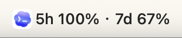
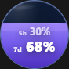
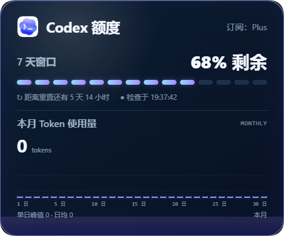

# Codex Quota Utilities (Unofficial)

Unofficial, local-first Codex quota utilities for macOS and Windows. The macOS
app uses a native menu bar dashboard. The Windows app uses a transparent
floating quota orb that appears while Codex is running.

## Preview

### macOS

<p align="center">
  
</p>

<p align="center"><em>Menu bar status item</em></p>

<p align="center">
  
</p>

<p align="center"><em>Expanded quota and local Mac status dashboard</em></p>

### Windows

<table align="center">
  <tr>
    <th>Floating quota orb</th>
    <th>Expanded quota panel</th>
  </tr>
  <tr>
    <td align="center" valign="middle">
      
    </td>
    <td align="center">
      
    </td>
  </tr>
</table>

## Downloads

### macOS · Apple silicon

<p align="center">
  <a href="https://github.com/ObsidianRelay/codex-quota-menubar-skill/releases/download/v2.7.0/CodexQuotaMenuBar-macOS-arm64.zip">
    
  </a>
</p>

<p align="center">
  macOS 13 or later · Apple silicon (M1 or newer) ·
  <a href="https://github.com/ObsidianRelay/codex-quota-menubar-skill/releases/tag/v2.7.0">Release notes and SHA-256</a>
</p>

### Windows · x64

The Windows 10/11 x64 version lives in `codex-quota-orb-windows/`. It displays
five-hour and weekly quota values in a movable floating orb and expands into a
weekly quota and monthly token-usage panel.

<p align="center">
  <a href="https://github.com/ObsidianRelay/codex-quota-menubar-skill/releases/download/v0.1.5/CodexQuotaOrb-Setup-0.1.5-x64.exe">
    
  </a>
</p>

<p align="center">
  Windows 10 or Windows 11 · x64 ·
  <a href="https://github.com/ObsidianRelay/codex-quota-menubar-skill/releases/tag/v0.1.5">Release notes and SHA-256</a>
</p>

The Windows installer is currently unsigned, so Windows may show a SmartScreen
warning because Authenticode signing is not configured yet.

## Features

### macOS

- Native AppKit menu bar utility for macOS 13 or newer
- Compact five-hour and weekly remaining percentages from the local Codex App Server
- Weekly-only fallback for accounts without a five-hour quota window
- Weekly reset time, refresh time, remaining-quota progress, and monthly token chart
- Native menu bar highlight while the borderless dashboard is open
- 60-second local CPU history and macOS memory-pressure status
- Borderless dark dashboard with no login item or extra permissions
- Source-only repository with repeatable build and verification scripts

### Windows

- Compact transparent 88×88 floating quota orb with five-hour and weekly quota values
- Weekly quota liquid level that accurately matches the displayed remaining percentage
- Smooth panel expansion and collapse without visible native-window jumping
- Weekly reset countdown, refresh time, monthly token total, daily chart,
  average, and peak usage
- Automatic show/hide based on the Codex desktop process
- Dragging, edge snapping, saved position, and multi-display correction
- Tray controls, single-instance protection, and current-user login startup
- Local App Server access only; no telemetry, browser cookies, or token storage

## Privacy

The app starts the locally installed Codex App Server over stdio for each quota
refresh. CPU and memory-pressure samples are read from local macOS APIs. The
utility does not contain API keys, Telegram IDs, account data, logs, or local
configuration, and it does not send Mac status data to an external service. The
Windows app observes mouse-down coordinates only while its quota panel is open
to dismiss on an outside click; it does not monitor keyboard input or retain
those coordinates.

## Requirements

### macOS

- macOS 13 or newer
- Apple Command Line Tools (`clang` and `codesign`)
- A locally installed and signed-in Codex app or CLI with App Server support

### Windows

- Windows 10 or Windows 11, x64
- A locally installed and signed-in Codex app or CLI

## Build and verify (macOS)

```bash
cd codex-quota-menubar
scripts/build_app.sh
scripts/verify_app.sh
open dist/CodexQuotaMenuBar.app
```

`build_app.sh` compiles the Objective-C source, packages the three local image
assets, performs an ad-hoc signature, and runs parser self-tests.
`verify_app.sh` additionally verifies the bundle signature, samples local Mac
status, and performs a real five-hour and weekly quota read. A passing self-test alone does
not prove that the live quota read succeeded.

## Repository contents

```text
codex-quota-orb-windows/
├── src/
├── assets/
│   └── screenshots/
│       ├── codex-quota-orb.png
│       └── codex-quota-panel.png
├── scripts/
├── package.json
└── README.md

codex-quota-menubar/
├── SKILL.md
├── agents/openai.yaml
├── assets/
│   ├── Info.plist
│   ├── icon-codex-dark-color.png
│   ├── icon-codex-light.png
│   ├── icon-fan.png
│   └── screenshots/
│       ├── codex-quota-dashboard.png
│       └── codex-quota-status-item.png
└── scripts/
    ├── build_app.sh
    ├── verify_app.sh
    └── src/main.m
```

Compiled applications under `dist/` are intentionally excluded from Git. A
GitHub source archive must be built and verified on the destination Mac before
use.

## Unofficial project and trademarks

This is an independent, unofficial project. It is not affiliated with,
endorsed by, or sponsored by OpenAI. OpenAI, Codex, and related marks and brand
assets belong to OpenAI and remain subject to OpenAI's brand guidelines.

## License

MIT for the project code. The license does not grant rights to OpenAI names,
logos, or other brand assets; see the trademark notice in `LICENSE`.
